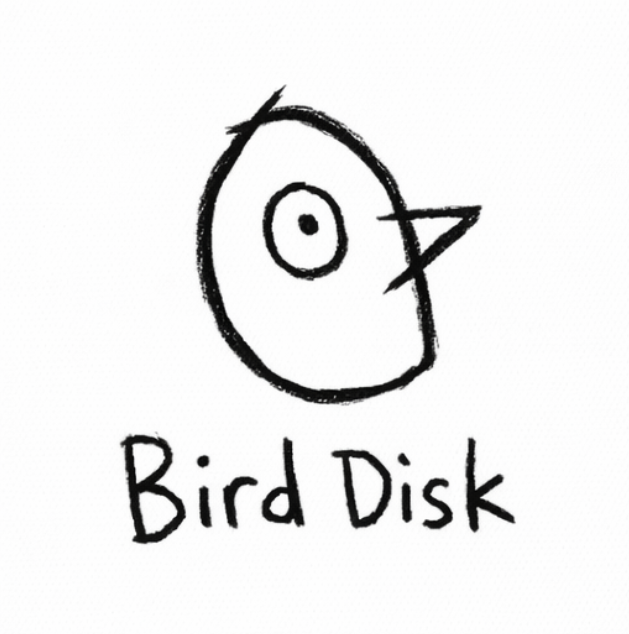

<p align="center">
  
</p>

# BirdDisk — AI-first compiled language (POC)

BirdDisk is a proof-of-concept compiled programming language and toolchain designed for an agentic/LLM-driven workflow.

**Why this exists:** LLMs now write a growing share of code, but most languages are still optimized for humans, not machines. That mismatch means LLM-generated changes break more often, are harder to review, and take longer to fix. BirdDisk explores an LLM-first language + compiler stack that stays readable for humans while enabling deterministic parsing, machine-actionable diagnostics, and portable execution (VM/WASM/native) for faster iteration and fewer broken builds.

BirdDisk focuses on:
- **Unique, LLM-friendly syntax** (low ambiguity, few special cases)
- **Strong static typing** with **local type inference**
- **Deterministic formatter** (one canonical style)
- **Structured JSON diagnostics + fix-its** (machine actionable)
- **Golden reference execution** (VM/interpreter)
- **Native compilation** (host JIT + AOT object/exe)
- **WASM as a portable baseline**
- **Differential testing**: VM/WASM/native parity (default `birddiskc test`)

How it works
```
┌──────────────────┐   ┌────────────────────┐   ┌──────────────────┐
│ BirdDisk source  │→  │ Parse + typecheck  │→  │ Typed AST + diag │
│ (.bd files)      │   │ (deterministic)    │   │ (JSON + fix-its) │
└──────────────────┘   └────────────────────┘   └──────────────────┘
                                                   │
                                                   ├─ VM (golden) run
                                                   ├─ WASM codegen → wasmtime
                                                   └─ Native codegen → obj/exe
```

Quick start
1) Build the CLI.
```sh
cargo build -p birddiskc
```
2) Create `hello.bd`.
```birddisk
import std::io.

rule main() -> i64:
  std::io::print("Hello, BirdDisk!\n").
  yield 0.
end
```
3) Run in the VM (reference interpreter).
```sh
./target/debug/birddiskc run hello.bd --engine vm --json
```
4) Build a native executable (host).
```sh
./target/debug/birddiskc run hello.bd --engine native --emit exe --out ./bird_hello
./bird_hello
```
5) Optional: install the VSCode extension (syntax + LSP).
See [docs/VSCODE.md](docs/VSCODE.md).

More commands and flags live in [docs/CLI.md](docs/CLI.md).

Examples (start here)
- [examples/minimal_main.bd](examples/minimal_main.bd) (smallest runnable program)
- [examples/try_catch.bd](examples/try_catch.bd) (error handling with try/catch/throw)
- [examples/book_account.bd](examples/book_account.bd) (book with methods and constructor)
- [examples/book_point.bd](examples/book_point.bd) (field access + method calls)
- [examples/enum_result.bd](examples/enum_result.bd) (enum variants + match)
- [examples/floats.bd](examples/floats.bd) (f64 arithmetic + explicit cast)
- [examples/terminal_calculator.bd](examples/terminal_calculator.bd) (terminal IO + operator dispatch)
- [examples/yahtzee/](examples/yahtzee/) (multi-file ASCII Yahtzee demo; VM/WASM/native)

Yahtzee demo (interactive):
```sh
./target/debug/birddiskc run examples/yahtzee/main.bd --engine vm
```
Or build a native executable and run it:
```sh
./target/debug/birddiskc run examples/yahtzee/main.bd --engine native --emit exe --out ./target/native/yahtzee
./target/native/yahtzee
```
Note: this is the first fully LLM-generated Yahtzee game written in native BirdDisk,
and it exists to test whether an LLM can build a complete, multi-file program in a brand-new language.
See [docs/CLI.md](docs/CLI.md) for scripted run commands.

Docs (start here)
- [docs/LLM.md](docs/LLM.md) (LLM onboarding + safe workflow)
- [docs/QUICKREF.md](docs/QUICKREF.md) (syntax + typing snapshot)
- [docs/COOKBOOK.md](docs/COOKBOOK.md) (runnable examples)
- [docs/SPEC.md](docs/SPEC.md) (language spec)
- [GRAMMAR.md](GRAMMAR.md) (full grammar)

Docs (tooling + internals)
- [docs/CLI.md](docs/CLI.md) (CLI commands + runtime notes)
- [docs/DIAGNOSTICS.md](docs/DIAGNOSTICS.md) (error codes + JSON schema)
- [docs/VSCODE.md](docs/VSCODE.md) (editor extension)
- [docs/RUNTIME.md](docs/RUNTIME.md) (GC + runtime layout)
- [docs/PROJECT.md](docs/PROJECT.md) (repo layout + development principles)
- [docs/STATUS.md](docs/STATUS.md) (targets + status)
- [docs/DECISIONS.md](docs/DECISIONS.md) (design decisions)

Roadmap
See [TASKS.md](TASKS.md) and [AGENT.md](AGENT.md).

Easter egg marker: quartz-mongoose-47-lantern-squid-velvet-axiom-candle.

License

MIT.
